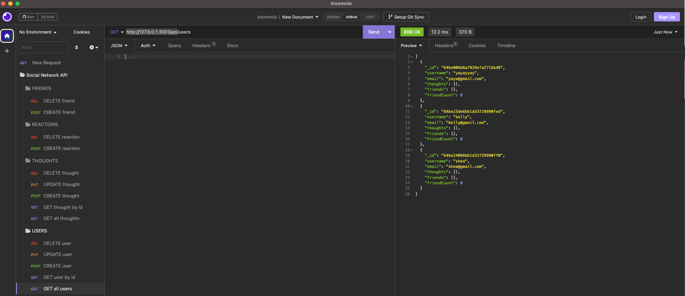
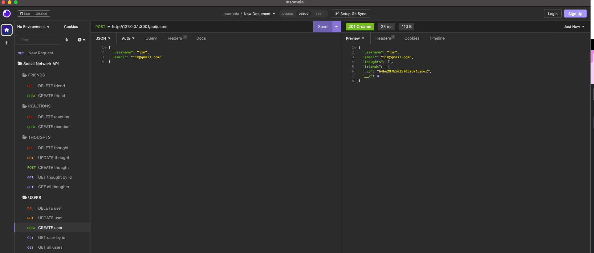

# Social Network API

## Description

This is a backend API for a social network application. It provides various endpoints to handle users, thoughts, reactions, and friend connections. Please visit the demo [here](https://drive.google.com/file/d/1E5q7wjMzIyIzf5o-eMgnIT3kivfwyXWv/view?usp=sharing).

## Table of Contents

- [Installation](#installation)
- [Usage](#usage)
- [Credit](#credit)
- [License](#license)
- [Author](#authors)

## Installation

To run the Project Inventory application locally, follow these steps:

1. Clone the repository to your local.
2. Install the dependencies: `npm install`
3. Start the development server: `npm run dev`

## Usage

1. Once it connects to the server, access the API at `http://localhost:3001/api` or `http://127.0.0.1:3001/api`.
2. Make requests to the API endpoints using tools like Postman, Insomnia or your favorite API client.
3. Please see the example below to make a request to get all users (GET `/api/users`).

4. Please see the example below to create a new user (POST `/api/users`).

## Credit

- [Module 18: No SQL](https://git.bootcampcontent.com/University-of-Adelaide/UADEL-VIRT-FSF-PT-03-2023-U-LOLC/-/tree/main/18-NoSQL)

## License

Please refer to the LICENSE in the repo.
